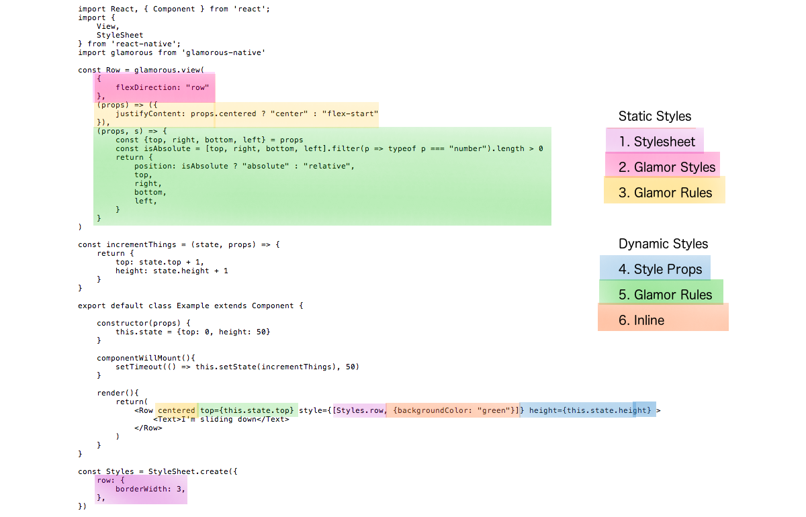

# glamorous-native
React Native component styling solved 💄

## concept

Define your react-native components with styles:

    import glamorous from 'glamorous-native'
    
    const Row = glamorous.view({
        flexDirection: "row"
    })
    
    <Row/>
    

Note the lowercase usage above. Or, use like so with some style props:

    <glamorous.View flexDirection="row" />

define your own glamor rules along side the styles:

    const Centered = glamorous.view(
        (props) => ({flexDirection: props.row ? "row" : "column"}),
        {
            justifyContent: "center",
            alignItems: "center",
        }
    })
    
    <Centered row/>
        
## left to do

Unlike the web version, here we have to divide styles into cachable (static) styles and dynamic styles which typically would change on animations

Because of that, let's start by defining which are which. Here is what I am proposing

We need to be able to pass glamor rules(functions) that can be either handled dynamically or become cached. I'm suggesting adding an extra parameter to dynamic glamor rules but perhaps someone can think of something better. 

    const Row = glamorous.view(
      {
        flexDirection: "row"
      },
      (props) => ({
        justifyContent: props.centered ? "center" : "flex-start"
      }),
      (props, s) => {
        const {top, right, bottom, left} = props
        const isAbsolute = [top, right, bottom, left].filter(p => typeof p === "number").length > 0
        return {
          position: isAbsolute ? "absolute" : "relative",
          top,
          right,
          bottom,
          left,
        }
      }
    )
