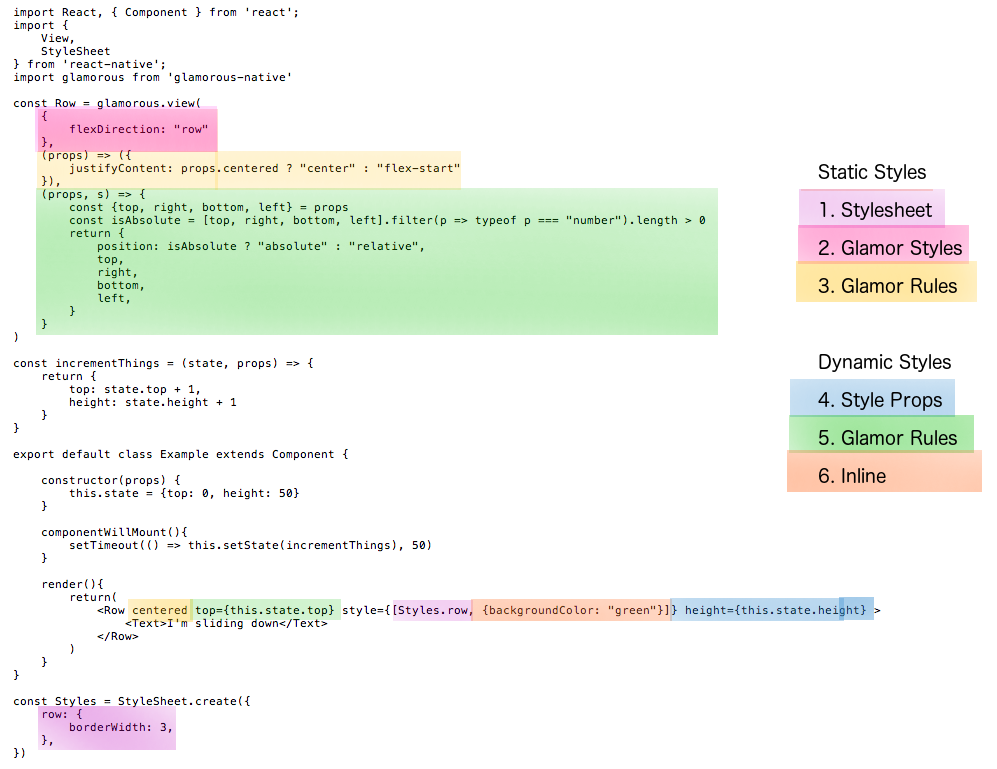

# glamorous-native
React Native component styling solved 💄

## initial work
Unlike the web version, here we have to divide styles into chachable (static) styles and dynamic styles which typically would change on animations

Because of that, let's start by defining which are which. Here is what I am proposing

We need to be able to pass glamor rules(functions) that can be either handled dynamically or become cached. I'm suggesting adding an extra parameter to dynamic glamor rules but perhaps someone can think of something better. 

    const Row = glamorous.view(
      {
        flexDirection: "row"
      },
      (props) => ({
        justifyContent: props.centered ? "center" : "flex-start"
      }),
      (props, s) => {
        const {top, right, bottom, left} = props
        const isAbsolute = [top, right, bottom, left].filter(p => typeof p === "number").length > 0
        return {
          position: isAbsolute ? "absolute" : "relative",
          top,
          right,
          bottom,
          left,
        }
      }
    )
